# Optimising Earnings for Uber Drivers In New York City


## Executive summary
This project uses K-means clustering to identify high-fare regions in NYC for Uber drivers. The analysis, with a moderate silhouette score of 0.48, clusters NYC into four regions. It helps drivers optimize routes and schedules to maximize earnings, especially during surge pricing.


## Data Preprocessing
The dataset used for this project was sourced from Kaggle's [Uber Fares Dataset](https://www.kaggle.com/datasets/yasserh/uber-fares-dataset/data). 
This dataset was chosen due to its fare amount, latitude, longitude making it suitable for this project to visualise areas in NYC where an Uber Driver can traverse to maximise their earnings.

### Loading and Initial Exploration
The CSV dataset is imported into a Pandas DataFrame using the `pd.read_csv()` function.
Insights was gained into its structure and contents. 

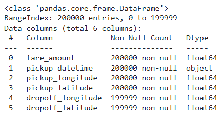

### Data Cleaning 

#### Removing missing values

Rows containing missing values were dropped to data integrity and accuracy in further analysis. Using `df = df.dropna()`.

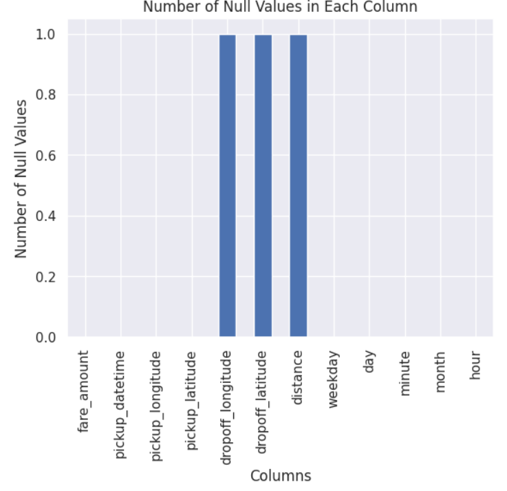

#### Removing irrelevant data
Relevant columns were selected through `usecols = ['pickup_datetime','pickup_longitude', 'pickup_latitude', 'dropoff_longitude', 'dropoff_latitude', 'fare_amount']. Before and after: 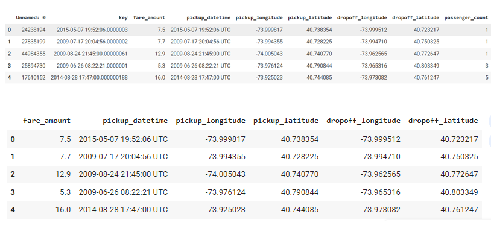


#### Removing outliers
Fare amounts can not be negative, hence removed and stored in uber_df. The longitude and latitude are restricted to New York as outliers outside this location was found (discovered later). 

`uber_df = df[(df['pickup_longitude'] >= -74.2591) &
                 (df['pickup_longitude'] <= -73.7004) &
                 (df['pickup_latitude'] >= 40.4772) &
                 (df['pickup_latitude'] <= 40.774) & (df['fare_amount'] <= 300) & (df['fare_amount'] > 0)]`

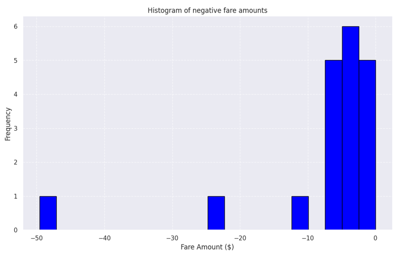

### Data Transformation 

Columns for weekday, day, minute, month, and hour are created from the PICKUP_DATETIME column by converting it from object to datetime datatype.
```df['pickup_datetime'] = pd.to_datetime(df['pickup_datetime'])
df['pickup_datetime'] = df['pickup_datetime'].dt.strftime('%Y-%m-%d %H:%M:%S')
df['pickup_datetime'] = pd.to_datetime(df['pickup_datetime'])


df['weekday']=df['pickup_datetime'].dt.day_name()
df['day']=df['pickup_datetime'].dt.day
df['minute']=df['pickup_datetime'].dt.minute
df['month']=df['pickup_datetime'].dt.month
df['hour']=df['pickup_datetime'].dt.hour
df.head()```

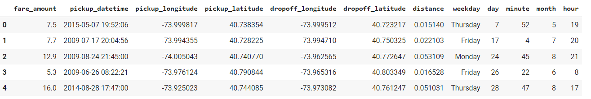


## Exploratory Data Analysis (EDA)

Exploratory Data Analysis (EDA) was conducted to gain an understanding of the dataset and extract insights prior to modeling. It was found that the average fare amount was $11.44, with the fare distribution exhibiting a positive skew. Uber pick-up frequency showed a significant increase after 8 PM, with Friday being the busiest day for trips. Outliers in the pick-up latitude and pick-up longitude were identified outside the NYC boundaries, prompting the dataset to be restricted to latitude and longitude values within NYC.A density heatmap of fare prices revealed that Upper Manhattan is a hotspot for relatively higher fare prices.

`uber_df.describe()`

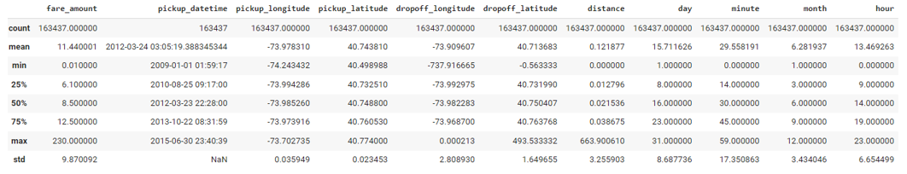

`plt.figure(figsize=(10, 6))`
`plt.hist(uber_df['fare_amount'], bins=50, edgecolor='k', color='green')`
`plt.title('Histogram of fare amount')`
`plt.xlabel('Fare amount ($)')`
`plt.ylabel('Frequency')`
`plt.grid(True)`
`plt.show()`

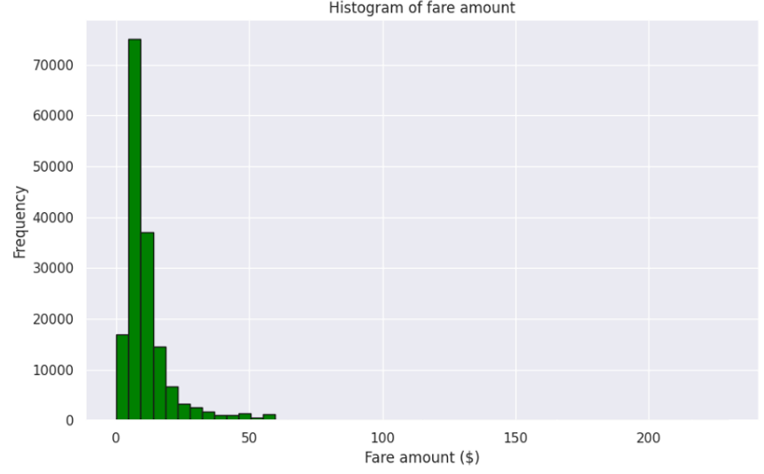

`plt.hist(uber_df['hour'])
`plt.title('Distribution of Hours')`
`plt.xlabel('Hour')`
`plt.ylabel('frequency')`
`plt.xlabel('work hour')`

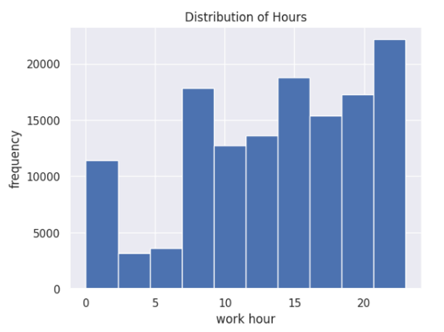

`import os`

`import plotly.express as px`
`import plotly.graph_objects as go`

`colors = ['lightslategray',] * 5`
`colors[0] = 'green'`

`fig = go.Figure(data=[go.Bar(
    x=df['weekday'].value_counts().index,
    y=df['weekday'].value_counts().values,
    marker_color=colors
)])`
`fig.update_layout(title_text='Busiest days for Uber Trips')`

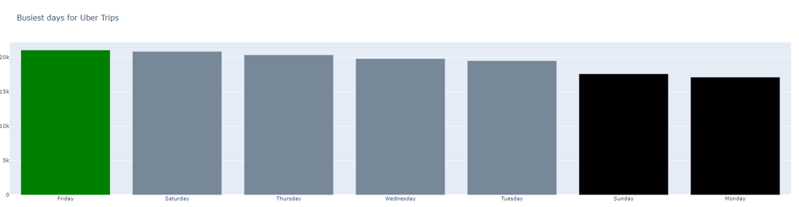

`import folium`
`from folium.plugins import HeatMap`
`import pandas as pd`


`m = folium.Map(location=[40.7128, -74.0060], zoom_start=12)`

`heat_data = [[row['pickup_latitude'], row['pickup_longitude'], row['fare_amount']] for index, row in uber_df.iterrows()]`

`HeatMap(heat_data, radius=15, max_zoom=13).add_to(m)`

`m.save('heatmap.html')`
`m`

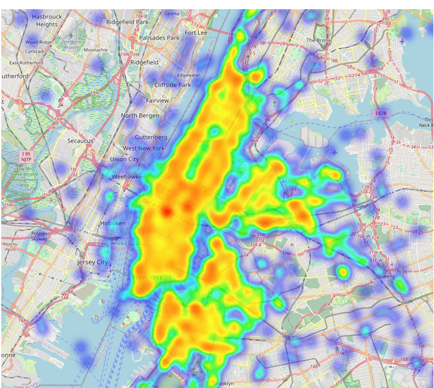


## Results and Analysis  

### Methodology

K-means clustering enables identification of clusters of areas with similar fare characteristics across NYC regions. K-means clustering was selected due to its robustness and ease of implementation; suited for this project as this is an unsupervised learning task.


### Elbow Method

The optimal number of clusters was determined by the Elbow method which plots the sum of squared distances between each point and cluster centroid against the number of clusters; the elbow point is then observed at the inflection point. 

The elbow method showed two inflections points at the n_clusters value of 2 and 4.  This requires additional evaluation as the number of clusters is not apparent.

`sse = []`
`k_range = range(1, 11)`
`for k in k_range:
    kmeans = KMeans(n_clusters=k, random_state=42)
    kmeans.fit(X_train)
    sse.append(kmeans.inertia_)`

`plt.figure(figsize=(10, 6))`
`plt.plot(k_range, sse, 'bx-')`
`plt.xlabel('Number of clusters')`
`plt.ylabel('Sum of squared distances')`
`plt.title('Elbow Method For Optimal k')`
`plt.show()`

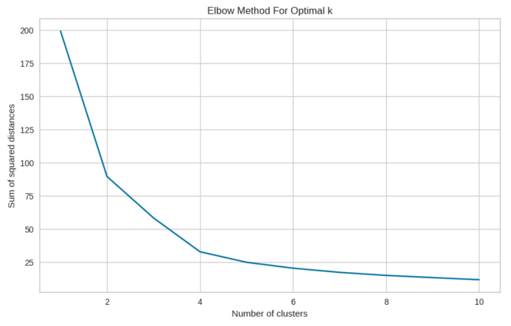

### Silhouette scores

Silhouette visualiser method is also employed to validate the number and quality of clusters, this is important as the right number of clusters ensure data is grouped accurately reflecting the underlying pattern. 

The silhouette visualizer method was used for further inspection to ensure meaningful clustering and to assess cluster quality. The clusters for each n_cluster should have silhouette scores greater than the average silhouette score of the dataset (indicated by the dotted red line), which n_cluster = 2 fails to achieve—an approach proposed by researchers. An n_cluster = 4 is selected as the optimal number of clusters, with a silhouette score of 0.48, indicating moderate clustering quality.

`from sklearn import datasets`
`from sklearn.cluster import KMeans`
`import matplotlib.pyplot as plt`
`from yellowbrick.cluster import SilhouetteVisualizer`

`fig, ax = plt.subplots(3, 2, figsize=(15,8))`
`for i in [2, 4]:
    km = KMeans(n_clusters=i, init='k-means++', n_init=10, max_iter=100, random_state=42)
    q, mod = divmod(i, 2)

    visualizer = SilhouetteVisualizer(km, colors='yellowbrick', ax=ax[q-1][mod])
    visualizer.fit(X_train)
    visualizer.ax.set_ylabel(f'Cluster {i}')
    visualizer.ax.set_xlabel('Average Silhouette Score')`

`plt.tight_layout()`
`plt.show()`

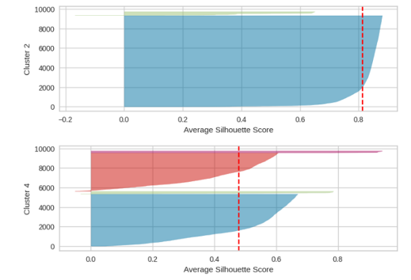


`range_n_clusters = list(range(3, 11))`

`silhouette_scores = []`

`for n_clusters in range_n_clusters:
    kmeans = KMeans(n_clusters=n_clusters, random_state=42)
    cluster_labels = kmeans.fit_predict(X_train)
    silhouette_avg = silhouette_score(X_train, cluster_labels)
    silhouette_scores.append(silhouette_avg)`

`plt.figure(figsize=(10, 6))`
`plt.plot(range_n_clusters, silhouette_scores, marker='o')`
`plt.title('Silhouette Scores for Different Numbers of Clusters')`
`plt.xlabel('Number of Clusters (k)')`
`plt.ylabel('Silhouette Score')`
`plt.grid(True)`
`plt.show()`

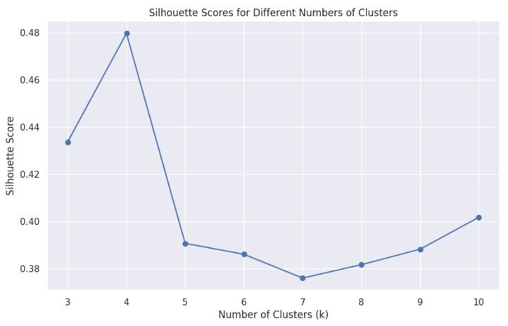


### Deploying K-means Clustering

`from sklearn.model_selection import train_test_split`

`X_train, X_test, y_train, y_test = train_test_split(uber_df[['pickup_latitude', 'pickup_longitude']], uber_df[['fare_amount']], test_size=0.33, random_state=0)`

`from sklearn.cluster import KMeans`

`kmeans = KMeans(n_clusters = 4, random_state = 0, n_init='auto')`
`kmeans.fit(X_train)`

### Results 

The clusters generated by K-means algorithm is visualised. Data is split into 4 distinct groups.
`sns.scatterplot(data = X_train, x = 'pickup_longitude', y = 'pickup_latitude', hue = kmeans.labels_)`

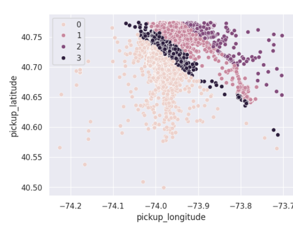

The distribution of fare prices is shown across the four clusters (figure 15).  From the fare distribution boxplot, cluster 2 has a higher median fare amount of $30 compared to $10 for the other clusters. This cluster corresponds to Upper Manhattan which is a hub for major tourist attractions which leads to frequent surge prices. LaGuardia airport is also situated in the cluster which suggests higher likelihood of longer trips and higher fares. 

`from matplotlib.ticker import MultipleLocator, AutoMinorLocator`
`sns.boxplot(x = kmeans.labels_, y = y_train['fare_amount'])`

`ax = plt.gca()`

`ax.yaxis.set_major_locator(MultipleLocator(10))`


`ax.yaxis.set_minor_locator(MultipleLocator(5))`


`ax.grid(which='minor', linestyle=':', linewidth='0.5', color='gray')`


`plt.show()`

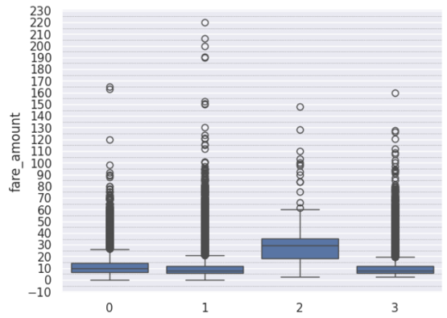

## Conclusion

In this project, we employed K-means clustering to analyze taxi fares across various regions in NYC. By grouping fare data, we identified areas like Upper Manhattan and the Bronx that have higher fare prices. These valuable insights suggest that Uber drivers should frequent these regions, particularly on Fridays between 8 PM and 12 AM, to maximize their earnings and counterbalance Uber’s increasing commission charges.

## Limitations 

K-means clustering assumes spherical and equally sized clusters, which may not be ideal for geospatial data like NYC Uber fares. The DBSCAN algorithm, on the other hand, is more suitable as it can handle non-linear cluster structures and considers the actual physical distance around each point, making it more effective for spatial longitude-latitude data.

## Recommendations for Future Iterations

1. Further work includes applying ARIMA models to clusters identified by K-means enhances analysis forecasting fare price trends over time for each specific cluster.
2. Use of Gap Statistic as further validation for optimal number of clusters

## References 


